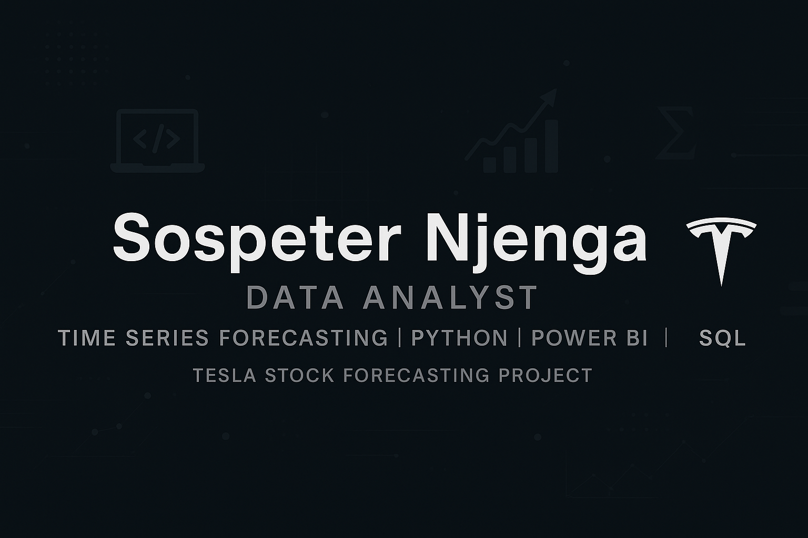

  

# 👋 Hi, I'm Sospeter Njenga

🎓 BSc. Statistics (Major in Data Science)  
📍 Nairobi, Kenya | 🌐 [Portfolio Website](https://sospeter03.github.io/)  
📬 sospeternjenga03@gmail.com

---

## 🚀 About Me

Aspiring Data Analyst with a strong background in statistical modeling, time series forecasting, and business intelligence.

My featured project — [Tesla Stock Forecasting](https://sospeter03.github.io/) — demonstrates ARIMA, SARIMA, LSTM, and Hybrid models with interactive documentation and diagnostics.

---

## 🔧 Tech Stack

- **Languages:** Python, R, SQL  
- **Tools:** Excel, Power BI, Tableau, SPSS, Stata  
- **Libraries:** pandas, statsmodels, scikit-learn, keras, plotly  
- **Certifications:** IBM (SQL), Google (R), Simplilearn (Excel, Power BI, Tableau)

---

## 📈 Featured Work

- 🔗 [Tesla Stock Forecasting](https://sospeter03.github.io/)
- 🛠 Forecasting pipeline with ARIMA, SARIMAX, LSTM, Hybrid modeling
- 📊 Includes model diagnostics, residuals, and evaluation metrics

---

## 📬 Connect with Me

  

> *“Turning data into decisions through forecasting and clarity.”*
